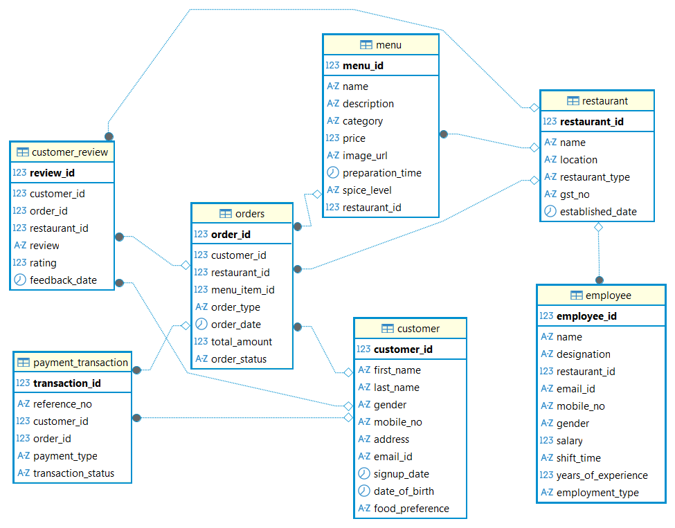

# 🍽️ Restaurant Management SQL Project

This project contains a sample **Restaurant Management Database** built using **MySQL**. It includes SQL scripts to create tables and insert realistic sample data for managing customers, restaurants, menus, orders, employees, payments, and reviews.  
Also included is an `exercise.sql` file containing **30 real-world SQL problems with their solutions** to help practice and demonstrate query writing skills.

---

## 📂 Contents

- `schema.sql` — SQL commands to create all tables (`Customer`, `Restaurant`, `Menu`, `Orders`, `Employee`, `Payment_Transaction`, `Customer_Review`)  
- `seed.sql` — SQL commands to insert sample data into the tables  
- `exercise.sql` — Solved real-world SQL queries based on the database schema (30 examples)  
- `README.md` — Project documentation and usage instructions  
- `.gitignore` — Git ignore file to exclude unnecessary files (e.g., `.DS_Store`, backup dumps, temp files)

---

## ✅ Requirements

To run and explore this project, you need the following installed:

- [MySQL Community Server](https://dev.mysql.com/downloads/mysql/) – The database engine used in this project  

- A SQL client tool such as:  
  - [DBeaver](https://dbeaver.io/) – Free, universal database management tool (recommended)  
  - [MySQL Workbench](https://dev.mysql.com/downloads/workbench/) – Official MySQL GUI client  
  - MySQL command-line client (`mysql`) – To run `.sql` files using the terminal or shell

> 💡 Tip: Use **DBeaver** for managing the database schema visually, executing queries, and exploring results interactively. You can also run all SQL scripts via CLI or MySQL Workbench.


---


## 🚀 Steps to Run the Project

1. **Clone the repository**

   Open your terminal and run:

   ```bash
   git clone https://github.com/your-username/restaurant-management-mysql.git
   cd restaurant-management-mysql
   ```

2. **Create the database**

   Log into your MySQL server using a client or CLI and create the database:

   ```sql
   CREATE DATABASE restaurant_db;
   USE restaurant_db;
   ```

3. **Run the schema script to create tables**

   This script (`schema.sql`) creates all the necessary tables: `Customer`, `Restaurant`, `Menu`, `Orders`, `Employee`, `Payment_Transaction`, and `Customer_Review`.

   #### Option A: Using DBeaver
   - Open DBeaver and connect to your MySQL server.
   - Navigate to the `restaurant_db` database.
   - Right-click and select **Tools > Execute script**.
   - Open and run `schema.sql`.

   #### Option B: Using MySQL Workbench
   - Open MySQL Workbench and connect to your server.
   - Open `schema.sql` in the SQL editor.
   - Select your database (`restaurant_db`) and execute the script.

   #### Option C: Using MySQL CLI
   Run the following command in terminal:

   ```bash
   mysql -u your_username -p restaurant_db < schema.sql
   ```

4. **Insert sample data**

   Run the `seed.sql` script to populate the tables with sample data.

   - **DBeaver:** Tools > Execute script > select `seed.sql` and run it.
   - **MySQL Workbench:** Open `seed.sql` in the editor and run.
   - **CLI:**

     ```bash
     mysql -u your_username -p restaurant_db < seed.sql
     ```

5. **Practice with real-world queries**

   Use the `exercise.sql` file to test and learn from 30 solved SQL problems based on this schema.

   - **DBeaver / Workbench:** Open `exercise.sql` and run queries one by one.
   - **CLI:** You can also run it via:

     ```bash
     mysql -u your_username -p restaurant_db < exercise.sql
     ```

6. **You're all set!**

   You can now explore, query, and modify the Restaurant Management database.

> 💡 **Tip:** Use DBeaver to visualize ER diagrams, browse data, and write queries more interactively.


---


## 🧩 Database Schema Diagram

Below is the ER diagram representing the relationships and structure of the restaurant database:



> 📌 Tip: This was generated using DBeaver's ER Diagram feature.


---


## 🗃️ Database Table Structures

Below is a breakdown of each table and its columns, with explanations of what each field represents.


### 1. CUSTOMER

Stores information about the customers using the restaurant platform.

| Column Name       | Data Type     | Description |
|-------------------|---------------|-------------|
| `customer_id`     | INT (PK)      | Unique identifier for each customer (auto-incremented). |
| `first_name`      | VARCHAR       | Customer's first name. |
| `last_name`       | VARCHAR       | Customer's last name. |
| `mobile_no`       | VARCHAR       | Customer's mobile phone number. |
| `address`         | VARCHAR       | Full address of the customer. |
| `email_id`        | VARCHAR       | Customer's email address. |
| `signup_date`     | DATE          | Date when the customer signed up. |
| `date_of_birth`   | DATE          | Customer’s date of birth. |
| `gender`          | ENUM          | Gender of the customer (`Male`, `Female`, etc.). |
| `food_preference` | ENUM          | Food preference (`Veg`, `Non-Veg`, `Vegan`, etc.). |


### 2. RESTAURANT

Details about partner restaurants.

| Column Name        | Data Type     | Description |
|--------------------|---------------|-------------|
| `restaurant_id`    | INT (PK)      | Unique ID for the restaurant. |
| `name`             | VARCHAR       | Name of the restaurant. |
| `location`         | VARCHAR       | Restaurant's physical address or locality. |
| `restaurant_type`  | VARCHAR       | Type of cuisine or service (e.g., Indian, Chinese, Multi Cuisine). |
| `gst_no`           | VARCHAR       | GST registration number for billing and tax. |
| `established_date` | DATE          | The date when the restaurant started operations. |


### 3. MENU

Menu items offered by restaurants.

| Column Name        | Data Type     | Description |
|--------------------|---------------|-------------|
| `menu_item_id`     | INT (PK)      | Unique identifier for the menu item. |
| `name`             | VARCHAR       | Name of the dish. |
| `description`      | TEXT          | Short description of the item. |
| `category`         | VARCHAR       | Category of the item (e.g., Main Course, Dessert). |
| `price`            | DECIMAL       | Price of the item. |
| `image_url`        | VARCHAR       | Optional image URL for display. |
| `preparation_time` | TIME          | Estimated prep time for the dish. |
| `spice_level`      | ENUM          | Spice level indicator (`Mild`, `Medium`, `Spicy`, etc.). |
| `restaurant_id`    | INT (FK)      | Foreign key linking to the `RESTAURANT` table. |


### 4. ORDERS

Tracks food orders placed by customers.

| Column Name      | Data Type     | Description |
|------------------|---------------|-------------|
| `order_id`       | INT (PK)      | Unique identifier for the order. |
| `customer_id`    | INT (FK)      | Customer who placed the order. |
| `restaurant_id`  | INT (FK)      | Restaurant from which the order was placed. |
| `order_type`     | ENUM          | Type of order (`Dine in`, `Take Away`). |
| `order_date`     | DATETIME      | Timestamp of the order. |
| `total_amount`   | DECIMAL       | Total cost of the order. |
| `order_status`   | ENUM          | Current status of the order (`Pending`, `Completed`, etc.). |
| `menu_item_id`   | INT (FK)      | The item that was ordered (links to `MENU`). |


### 5. EMPLOYEE

Details of employees working at various restaurants.

| Column Name           | Data Type     | Description |
|------------------------|---------------|-------------|
| `employee_id`          | INT (PK)      | Unique identifier for the employee. |
| `name`                 | VARCHAR       | Full name of the employee. |
| `designation`          | VARCHAR       | Job title or role (e.g., Chef, Manager). |
| `restaurant_id`        | INT (FK)      | Restaurant where the employee works. |
| `email_id`             | VARCHAR       | Email address of the employee. |
| `mobile_no`            | VARCHAR       | Contact number. |
| `gender`               | ENUM          | Gender of the employee. |
| `salary`               | DECIMAL       | Monthly salary. |
| `shift_time`           | ENUM          | Work shift (`Morning`, `Evening`, `Night`). |
| `years_of_experience`  | INT           | Experience in years. |
| `employment_type`      | ENUM          | `Fulltime` or `Parttime`. |


### 6. PAYMENT_TRANSACTION

Captures payment transaction details for each order.

| Column Name         | Data Type     | Description |
|----------------------|---------------|-------------|
| `transaction_id`     | INT (PK)      | Unique ID for the transaction. |
| `reference_no`       | VARCHAR       | Payment reference number. |
| `customer_id`        | INT (FK)      | Customer who paid. |
| `order_id`           | INT (FK)      | Linked order. |
| `payment_type`       | ENUM          | Method used (`Credit Card`, `Cash`, `UPI`, etc.). |
| `transaction_status` | ENUM          | Status (`Completed`, `Pending`, `Failed`). |


### 7. CUSTOMER_REVIEW

Stores feedback and ratings provided by customers after an order.

| Column Name     | Data Type     | Description |
|------------------|---------------|-------------|
| `review_id`      | INT (PK)      | Unique ID for the review. |
| `customer_id`    | INT (FK)      | Who gave the review. |
| `order_id`       | INT (FK)      | Related order. |
| `restaurant_id`  | INT (FK)      | Related restaurant. |
| `review`         | TEXT          | Textual feedback. |
| `rating`         | DECIMAL       | Rating out of 5 (e.g., 4.5). |


---


## 📝 Exercise Queries

This project includes an `exercise.sql` file containing **30 solved real-world SQL problems** based on the restaurant management database. These exercises cover common tasks such as schema alterations, data manipulations, complex queries, and reports.

Here’s a summary of the exercises included:

1. Add a new column to track feedback given date to customer review table  
2. Change the maximum length of phone number in the Customer table  
3. Add a unique constraint on the email column in the Restaurant table  
4. Add a new column in Payment_Transaction to track payment status  
5. Add a CHECK constraint on the status column in Payment_Transaction with accepted values: 'success', 'pending', 'failed'  
6. Set a default value of 'Male' for the gender column in Customer table  
7. Update the first name to 'Raju' for the customer whose last name is 'Sekhar'  
8. Delete feedback entries where customer ID is 3  
9. Add a new food menu item 'Pizza'  
10. Retrieve order details along with customer and restaurant names  
11. Get restaurant names along with the number of menu items they offer  
12. Find customers who have 'Non Veg' as their food preference  
13. Add a new column `create_date` in the Restaurant table  
14. Drop the `create_date` column from the Restaurant table  
15. Update order status to 'Delivered' for orders placed by customer 'Anjali'  
16. Show all orders placed by customer 'Rajeev'  
17. Calculate the total revenue generated by the restaurant named 'Udupi'  
18. Insert a new restaurant entry for 'Santhosh Dhaba'  
19. Find restaurants that have more than 5 menu items  
20. Insert multiple new menu items: Idly, Dosa, and Apple Juice  
21. Find the customer(s) who gave the highest feedback rating  
22. Fetch 5 feedback records starting after the 10th record (pagination)  
23. Find restaurants where the GST number is not specified  
24. Find orders where payment has failed  
25. Classify restaurants into 'High', 'Medium', and 'Low' based on average feedback ratings  
26. Find top menu items based on the number of times they were ordered  
27. Delete customers who have never placed an order  
28. Increase the price of all menu items in 'Udupi' restaurant by 10%  
29. Create a SQL view showing combined customer and order details  
30. Use an INSERT...SELECT statement to add feedback after an order moves to 'Completed' status  

> These exercises aim to reinforce your skills in database schema modification, data querying, reporting, and managing real-world restaurant data efficiently.

You can find all the detailed solutions in the [`exercise.sql`](./exercise.sql) file included in this project.


---


## 🛠 Tools Used

- **MySQL** – Relational database management system used to design and run the project.
- **DBeaver** – Recommended SQL GUI client used for:
  - Running SQL scripts (`schema.sql`, `seed.sql`, `exercise.sql`)
  - Viewing and managing data
  - Generating the ER diagram
- **Git & GitHub** – Version control and project sharing
- **Markdown** – For documenting the project in `README.md`


---


## 🧠 Author Notes

This project was built as part of a hands-on SQL learning journey, using a realistic **restaurant management system** as the use case. It helps in:

- Understanding relational database design
- Practicing SQL operations with real-world-like data
- Writing practical queries for data analysis and reporting

The project includes a collection of **30 solved real-world SQL problems** in the `exercise.sql` file, making it an ideal resource for beginners and intermediate learners looking to sharpen their SQL skills.

Feel free to clone, modify, and use this project for your own learning, interview preparation, or as a base for more advanced data projects.

> 🚀 Happy Querying!

